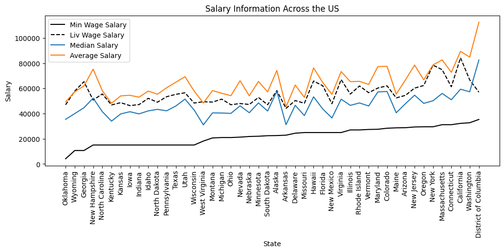

# Salary & Education
## Data Analysis for National Salaries, Teacher Salaries, and School Enrollment

The project contained in this repository explore and visualize data.

Libraries Used: NumPy, Pandas, GeoPandas, Matplotlib

Screenshot of Visualization:
